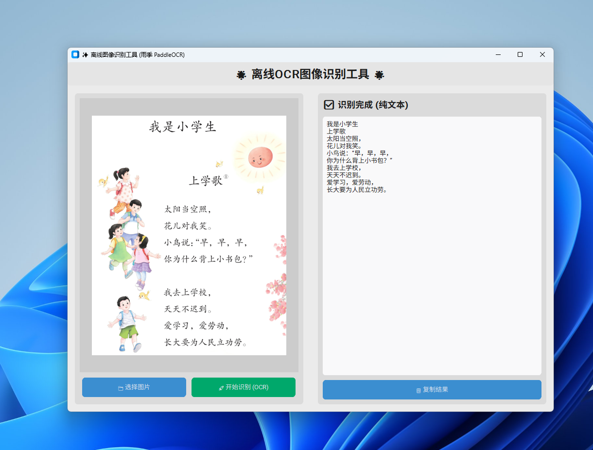
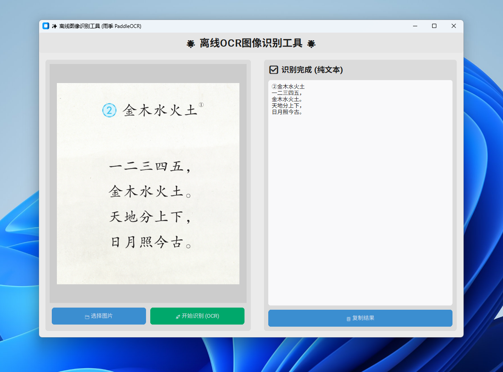

# python实现 本地离线 图片文本识别
## 采用PaddleOCR

效果如下
|  |  |
| ----------------- | ----------------- |

### 安装环境

```shell
#创建新的虚拟环境 （或者vscode自动创建）
python -m venv .venv
#激活新环境
.venv\Scripts\activate.bat
#安装插件
pip install paddleocr paddlepaddle -i https://pypi.tuna.tsinghua.edu.cn/simple
pip install customtkinter
```

### 运行

```shell
#首次运行会自动下模型
python.exe main.py
```


### 简单demo

```python
from paddleocr import PaddleOCR
# 初始化 PaddleOCR 实例
ocr = PaddleOCR(
    use_doc_orientation_classify=False,
    use_doc_unwarping=False,
    use_textline_orientation=False)

result = ocr.predict(input="01.png") # 标准调用方式，而不是使用ocr.ocr

#解析
for res in result:
    # res.print()
    # res.save_to_img("output")
    # res.save_to_json("output")
    data = res.json['res']
    rec_texts = data.get('rec_texts', [])
    rec_scores = data.get('rec_scores', [])
    for i, text in enumerate(rec_texts):
        score = rec_scores[i] if i < len(rec_scores) else "N/A"
        print(f"{text} (置信度: {score:.4f})") # text=识别的文字内容，score=置信度 

```

# 带API的版本，允许其他模块调用
```shell
#安装依赖
pip install flask flask_cors
```

启动
```shell
python.exe web_api.py
```